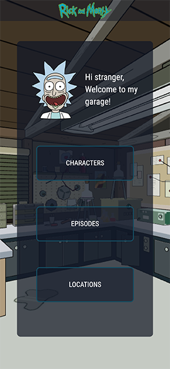
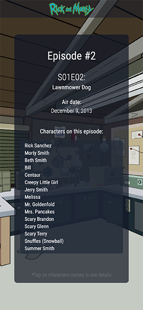
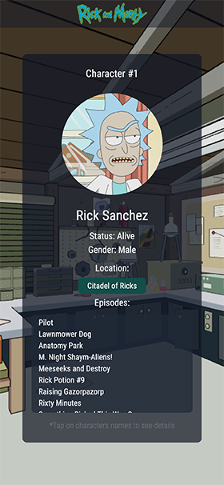

<h1 align="center">Rick and Morty 🧪 </h1>

## About the project

Rick and Morty app built with React, bootstrapped with [Vite](https://vitejs.dev/).
Explore characters, episodes and locations.
All data is fetched from the [Rick and Morty GraphQL API](https://rickandmortyapi.com/documentation/).

## Overview





### Built With

- [React](https://reactjs.org/)
- [Typescript](https://www.typescriptlang.org/)
- [Tailwind CSS](https://tailwindcss.com/)
- [GraphQL](https://graphql.org/)
- [Apollo Client](https://apollographql.com/)
- [React Three Fiber](https://docs.pmnd.rs/react-three-fiber)
- [gltfjsx](https://github.com/pmndrs/gltfjsx)

## How To Use

To clone and run this application locally, you'll need [Git](https://git-scm.com) and [Node.js](https://nodejs.org/en/download/) (which comes with [npm](http://npmjs.com)) installed on your machine.

From your command line:

```bash
# Install dependencies
$ npm install

# Run the app
$ npm run dev
```

## 3D Model License

This work is based on ["Rick and Morty Garage (Fan Art)"](https://sketchfab.com/3d-models/rick-and-morty-garage-fan-art-4e882af2241d43bc9870ad7ef13fe539) by [Nika Mumladze](https://sketchfab.com/nikam12345678) licensed under [CC-BY-4.0](http://creativecommons.org/licenses/by/4.0/).
